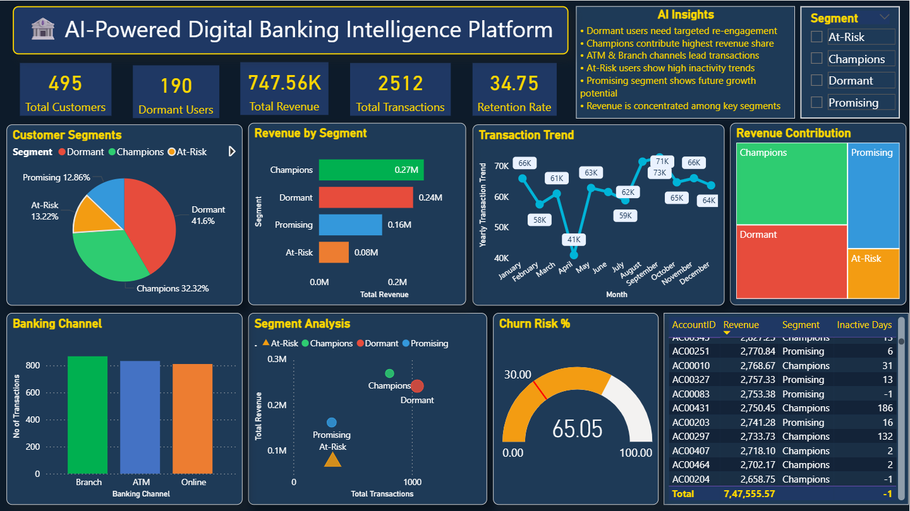

# 🏦 AI-Powered Digital Banking Customer Intelligence Platform

## 📌 Project Overview
An end-to-end Banking Intelligence System that analyzes 
customer behavior, detects fraud, predicts churn, and 
segments customers using Machine Learning and SQL Analytics.

## 🛠️ Tech Stack
| Tool | Purpose |
|------|---------|
| Python & Pandas | Data Cleaning & Feature Engineering |
| MySQL | Database & Advanced SQL Analysis |
| Scikit-learn | Machine Learning Models |
| Power BI | Interactive Dashboard |

## 📊 Key Findings
- 495 customers analyzed across 2,512 transactions
- Total Revenue: $747,556
- 190 Dormant customers identified (churn risk)
- 25 Fraud-risk accounts detected automatically
- Churn Prediction Model: 85% accuracy

## 🤖 ML Models Built
- 🔵 K-Means Clustering → 4 customer segments
- 🟠 Random Forest → 85% churn prediction accuracy
- 🔴 Isolation Forest → 25 fraud accounts detected

## 📁 Project Structure
├── 01_data_cleaning.ipynb
├── 02_machine_learning.ipynb
├── Banking-Intelligence.SQL
├── customer_final.csv
├── Banking.Dashboard.png
└── AI-powered digital banking customer.pbix## 💡 Business Recommendations
1. Re-engage 190 dormant customers immediately
2. Investigate 25 fraud-risk accounts
3. Focus on Champions segment for upselling
4. Improve online channel revenue (currently lowest)

## 👨‍💻 Author
**Abhilash Koninti**# banking-customer-intelligence-platform
AI-Powered Digital Banking Customer Intelligence Platform using Python, SQL, Machine Learning and Power BI
